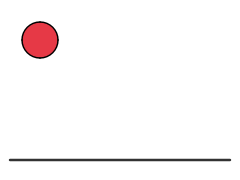

# AnimEngine 2

A modern reimplementation of [AnimEngine](https://github.com/DehydratedWater/AnimEngine)
(the Java vector-animation editor) in Python — keyframe animation with real
tweening, mixed vector/raster layers, audio, many import/export formats, a
full programmatic API and an MCP server so LLM agents can create animations.



## Quick start

```sh
uv sync            # install everything (Python 3.12+, uses PySide6)
uv run animengine  # launch the editor
uv run pytest      # 94 tests
uv run python examples/make_windmill.py   # build a 5-layer animation via the API
```

Video export needs `ffmpeg` on PATH.

## What's here

**Editor** — dockable canvas / timeline / layers / tool options.
All original tools, modernized: line, rectangle, cubic curve (click-click-click,
right-click steps back), freehand pen with simplification + auto-close, smooth
pen (bezier fitting), bucket fill (left fill/recolor, right delete), select &
transform box (corner = scale, outer square = rotate, optional v1 "cut-out"
mode that slices strokes at the marquee edge), add-point, scissors (Alt =
detach), style applicator, style picker (syringe), point eraser, raster brush
+ eraser, bitmap move/scale/rotate. Endpoint snapping (15 px) welds points and
splits crossed lines exactly like the original; Ctrl bypasses snapping.

**Timeline** — sparse keyframes per layer with hold / linear / ease
interpolation (the original stored full snapshots per frame with no tweening).
Scrub, drag keyframes, double-click to add, right-click for context menu,
`c→` copies the current frame forward — the classic frame-by-frame workflow.
Onion skinning, loop playback, adjustable fps.

**Layers** — unlimited vector + raster layers with visibility, lock, opacity,
rename and reorder (v1's layer manager had none of these). Full undo/redo of
everything (v1 had 3 undoable tools and no redo).

**Performance** — spatial-grid indexes, batched painting and epoch-keyed
render caches keep editing interactive on scenes with **millions of points**:
snapping ~0.4 ms, stroke commit ~200 ms, cached repaint ~0 ms at 1M points
(`tests/test_perf.py` guards these budgets).

**Files**
- native `.aep2` (zip: JSON + PNG assets + audio)
- imports: legacy AnimEngine `.ae` (both format generations), SVG,
  Lottie JSON (with keyframes), GIF, image sequences, sprite sheets
- exports: PNG, PNG sequence, GIF, MP4/WebM (audio muxed), SVG, sprite sheet

**Audio** — clips embedded in the project with start frame / gain / trim,
mixed into video exports through ffmpeg.

**Programmatic API** — everything works headless:

```python
from animengine.api import AnimProject

p = AnimProject(640, 400, fps=24)
p.add_rect(50, 50, 100, 100)
p.fill_region(100, 100, "#e63946")
p.copy_frame_forward()                      # keyframe like v1's c-->
p.transform_points([...], dx=40, rotate_deg=15)
p.export("out.gif", kind="gif")
```

**MCP server** — `uv run animengine-mcp` exposes 35+ tools (draw, edit
points/connections, keyframes, layers, audio) plus *vision* tools
(`render_frame`, `render_filmstrip`, `render_animation`) so a multimodal LLM
can draw, look at the result and iterate. See [docs/MCP.md](docs/MCP.md) for
Claude Code and opencode + local vLLM (qwen) configs.

## Layout

```
src/animengine/
  core/    pure-Python model: geometry, scene (points/connections/fills),
           keyframes + interpolation, undo, spatial index
  render/  headless QPainter renderer (offscreen-capable)
  io/      .aep2, legacy .ae importer, SVG/Lottie/GIF/spritesheet importers,
           all exporters
  audio/   clip loading + ffmpeg mix graphs
  api/     AnimProject — the high-level undoable API (GUI + MCP share it)
  mcp/     MCP stdio server
  ui/      PySide6 editor
examples/  bounce + windmill built entirely through the API
```
